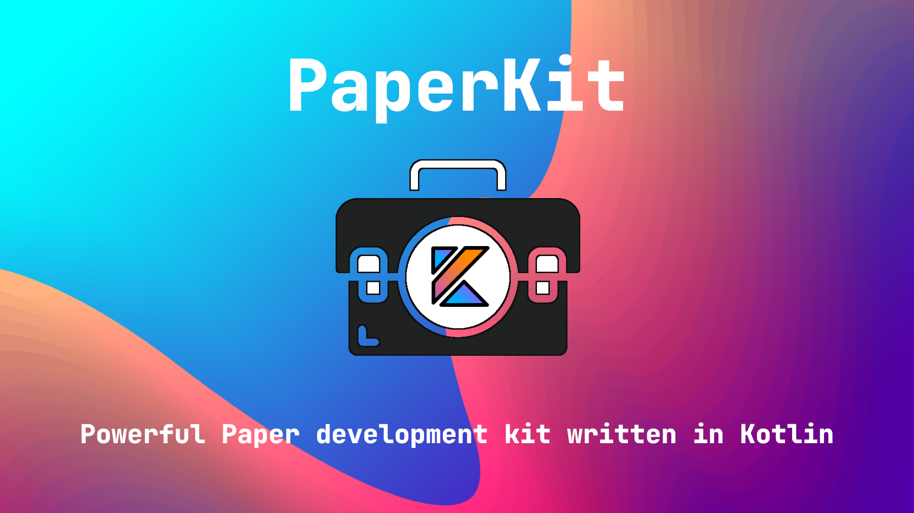

# PaperKit — set of libraries to develop Paper plugins in Kotlin easy and fast

This project currently is under active development and is not recommend for use in production yet.
Although you are welcome to try it out and share your feedback.

## Targets

The main targets behind PaperKit are to make development of Paper plugins in Kotlin as easy as possible,
and provide the developers with bunch of useful solutions for the most problematic parts of the development process.

## Modules

- [Core](./core) — contains only the Kotlin implementation of Paper components, that provide you with fearless
  experience.

## Contribution

PaperKit is open for anyone to contribute to, as with code, as with ideas and suggestions.

### Special Thanks to:

[JetBrains](https://www.jetbrains.com/), who supports PaperKit with one of
their [Open Source Licenses](https://www.jetbrains.com/opensource/). IntelliJ IDEA is the recommended IDE for working
with PaperKit.
